We are a team of skilled Full Stack Developers with many years of combined experience in developing web applications.
Our team has a strong background in software development and has worked with international clients from various
industries such as finance, retail, and e-commerce. As problem solvers at heart, we enjoy working on challenging
projects and delivering innovative solutions.

We have a deep understanding of web development frameworks and have experience in developing custom APIs, integrating
third-party libraries, and optimizing web applications for performance and usability. Throughout our careers, we have
developed many web applications for different platforms such as desktop, mobile and tablets. We are skilled in HTML,
CSS, JavaScript, React, Angular, Node.js and PHP. Our passion for technology and commitment to quality have earned us a
reputation as a reliable and efficient Full Stack Development team.

We have a track record of delivering high-quality projects on time and within budget, and our clients appreciate our
communication skills and our ability to understand their needs and goals. As a team, we collaborate closely with our
clients to ensure that we develop the best possible solutions for their businesses. We take pride in our work and are
committed to providing exceptional service to our clients.

## GAGE

Gage is an employee and group engagement tool designed to deliver insights while creating a shared experience.
Gage transforms team gatherings, surveys and poll taking into an interactive shared experience, while providing valuable
insights and analytics so you can learn more about your people.  
The product is owned by Activ8 Games & developed by Geniteam as sole development partner. This product was used in
Local & international conferences online at various levels.

### Main Technologies/Libraries Used

React.js,
Firebase,
Flux,
Bootstrap,
cross-env,
lodash,
moment,
reactstrap,
react-chartjs-2,
react-data-table-component,
react-csv,
react-datetime,
react-image-crop,
react-notifications,
react-quill,
react-switch,
shards-react,
shortid,
styled-components,
sweetalert2,

## Progress

At enhancing employee engagement and learning through the use of surveys and quizzes related to online gaming. Our
platform offers a fast-paced and engaging way for employees to learn and assess their knowledge and skills, while also
providing detailed analytical reports for the backend. Through situational-based learning, we aim to increase the
efficiency and effectiveness of employees while also evaluating four strengths in one go. Our dynamic content and
leaderboard feature offer multi-level engagement for employees, and our analytical reports provide detailed insights for
employers to improve their training programs. Overall, our platform offers an innovative and effective solution for
employee training and development.

### Main Technologies/Libraries Used

React.js,
Firebase,
bootstrap,
reactstrap,
google-spreadsheet,
moment,
multiselect-react-dropdown,
node-sass,
nouislider,
react-chartjs-2,
react-circular-progressbar,
react-copy-to-clipboard,
react-csv,
react-data-table-component,
react-datepicker,
react-loading-skeleton,
styled-components,

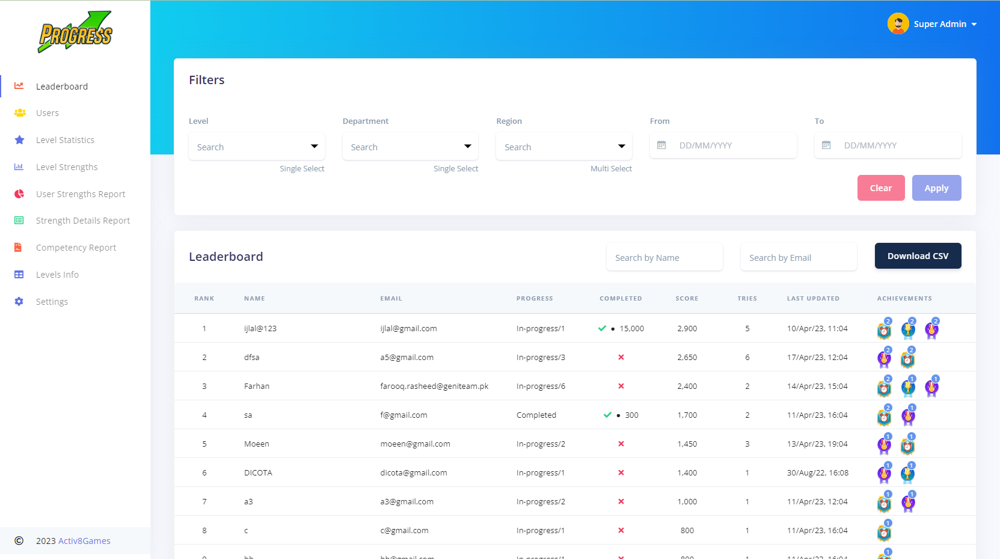
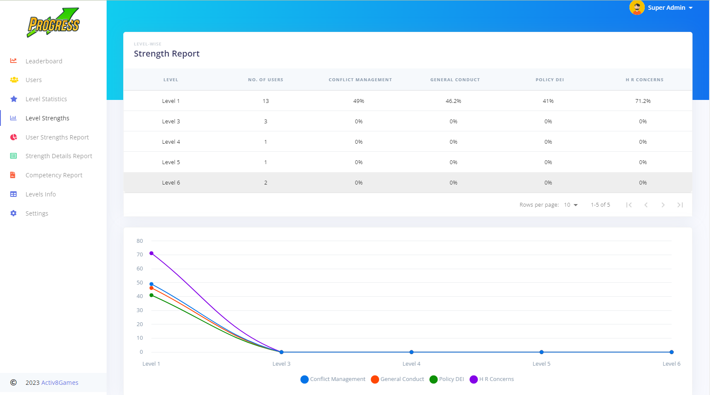

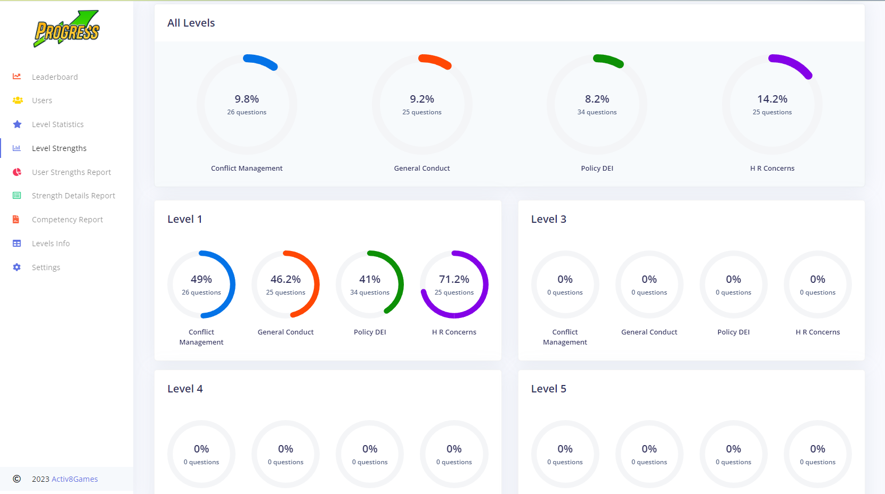
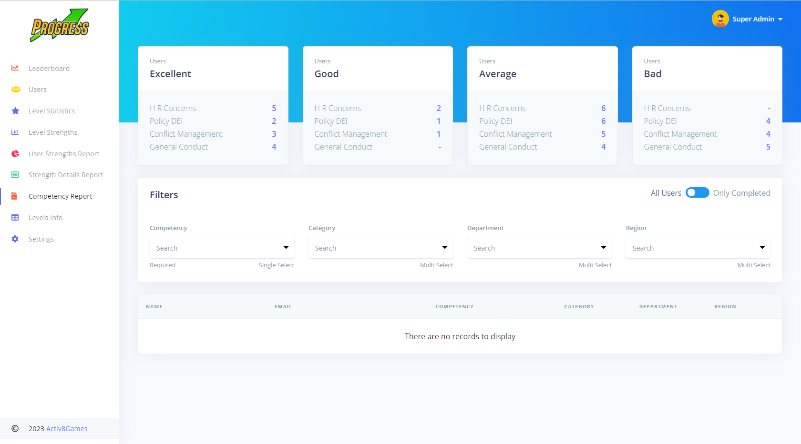

## Litty

A dynamic platform that allows users to share their stories, connect with others, and
engage in real-time conversations, as well as read books and listen to audio books. Our app provides a user-friendly
interface that makes it easy to create and share content, discover new books and audiobooks, and connect with
like-minded individuals from around the world. With features such as bookshelves, audiobook players, commenting, and
liking, our platform fosters a vibrant community that encourages creativity, collaboration, and social interaction, as
well as a love for literature. Whether you're an avid reader, a writer, or just looking for a new way to connect with
others, our app provides a fun and engaging space where you can share your passions, discover new content, and build
meaningful relationships.

### Main Technologies/Libraries Use

React.js,
Firebase,
Stripe,
Flux,
Bootstrap,
core-js,
enzyme,
moment,
node-sass,
noty,
numeral,
react-list-drag-and-drop,
react-loading-skeleton,
react-quill,
react-redux,
redux,
uuidv4,

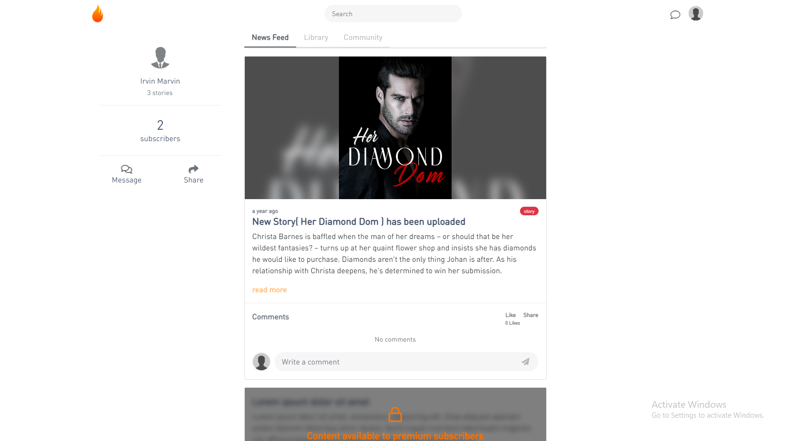
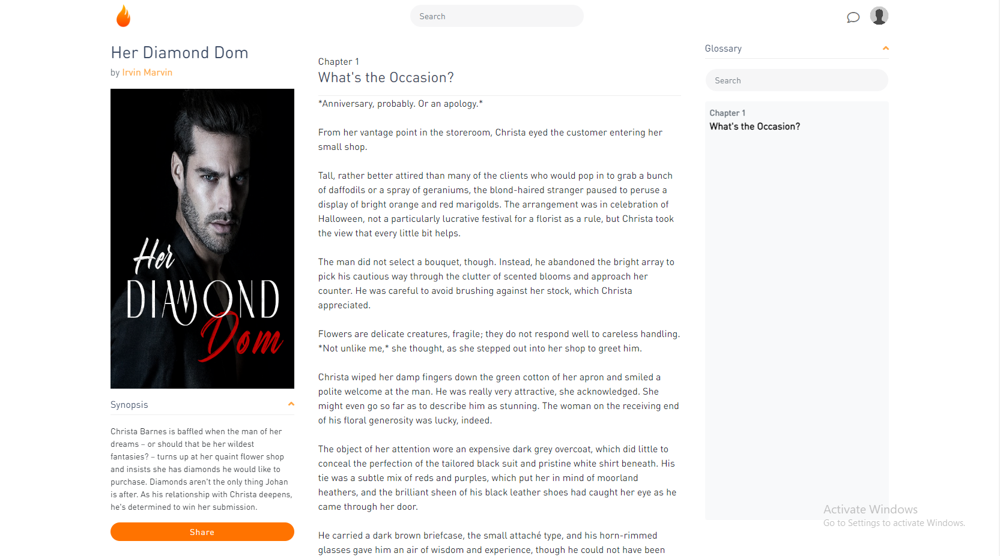

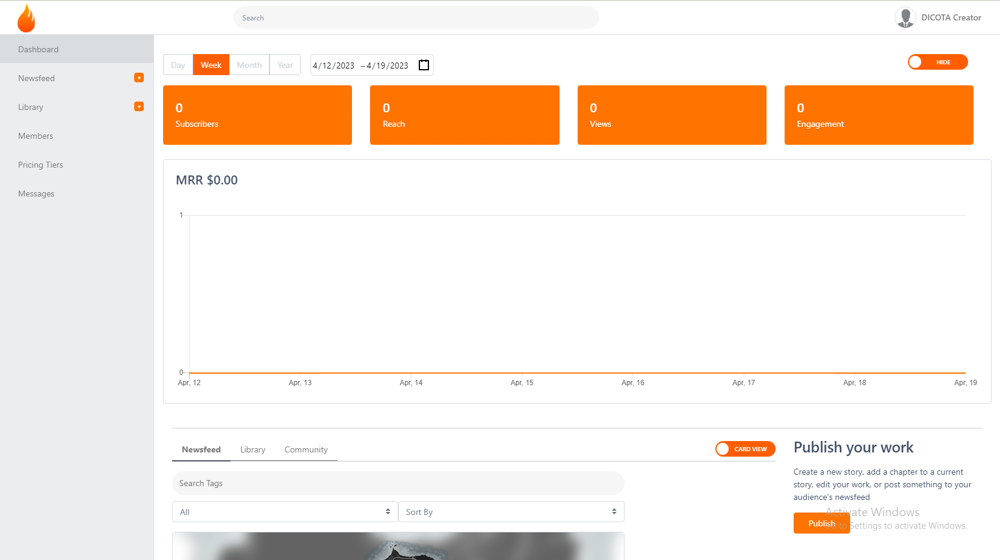
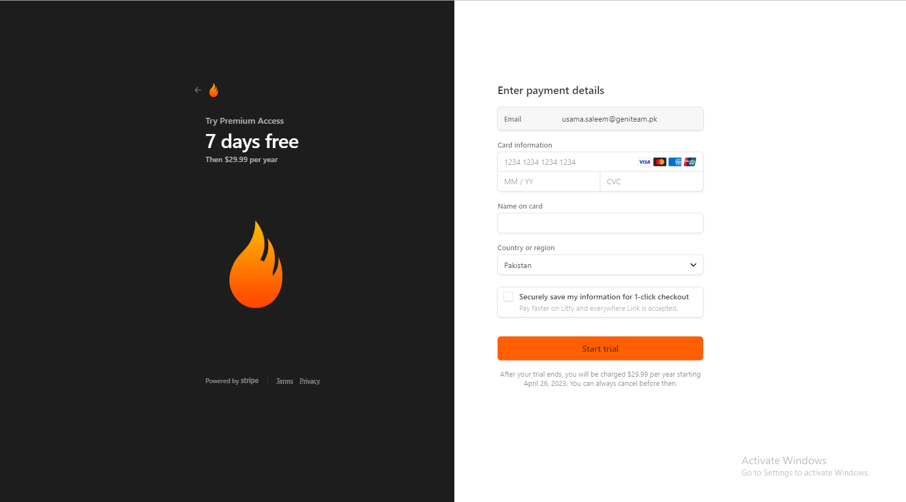

## Tournament

In today's world, online gaming has become a popular source of entertainment for people of all ages. With the increasing
popularity of games, the demand for competitive gameplay has also increased. This is where our project comes in. Our
project is a web application built using React.js that allows users to create and manage tournaments for various games.
The application automates the entire process of tournament creation and management, including player registration, team
creation, match scheduling, and tournament bracket generation. The application can be integrated into any type of game,
making it a versatile tool for game organizers and enthusiasts alike. Overall, our project aims to provide a seamless
and efficient tournament management experience for gamers worldwide.

### Main Technologies/Libraries Use

React.js, amazon-cognito-identity-js, antd, aws-sdk, bootstrap, chart.js,
enzyme, enzyme-adapter-react-16, mdbreact, node-fetch, node-sass, pubnub,
pubnub-react, react-aws-s3, react-captcha-generator, react-chartjs-2,
react-cookie, react-facebook-login, react-google-login, react-redux,
react-test-renderer, react-tournament-grid, reactstrap, redux, simple-line-icons, sweetalert2

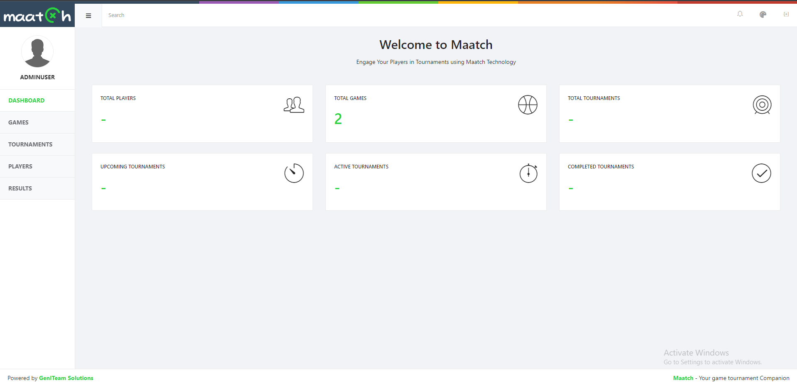
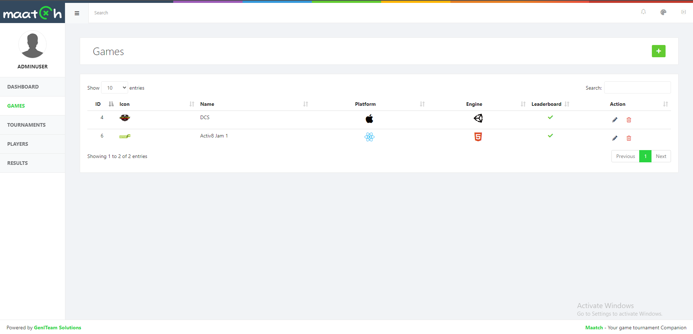

## Advance

Advance
Systematic business learning Game with 3 levels of decision making & flow. Detailed Backend with Analytical reports for
player progress as well as Leaderboard.
<ul>
<li>Manage per stage different competency</li>
<li>3 Levels of decision making in each stage</li>
<li>27 outcomes per stage</li>
<li>Backend Leaderboard</li>
<li>Analytical reports & lot more</li>
</ul>

### Main Technologies/Libraries Used

React.js,
Firebase,
bootstrap,
reactstrap,
google-spreadsheet,
moment,
multiselect-react-dropdown,
node-sass,
nouislider,
react-chartjs-2,
react-circular-progressbar,
react-copy-to-clipboard,
react-csv,
react-data-table-component,
react-datepicker,
react-loading-skeleton,
styled-components,

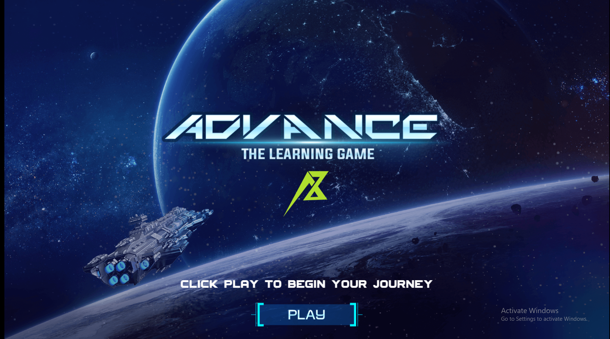

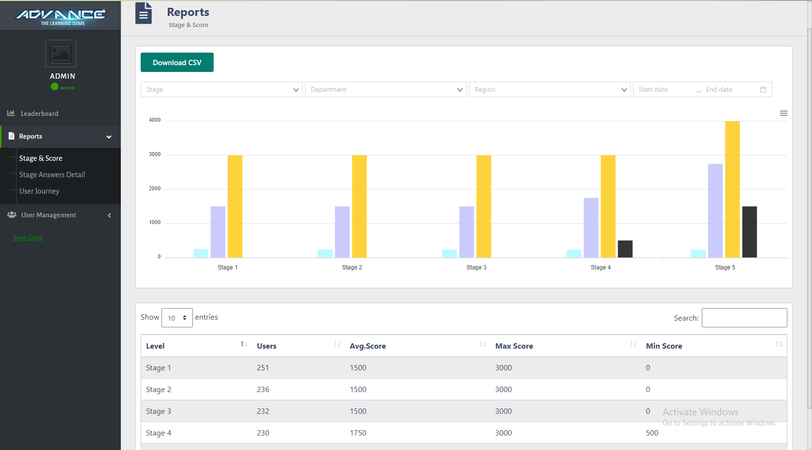
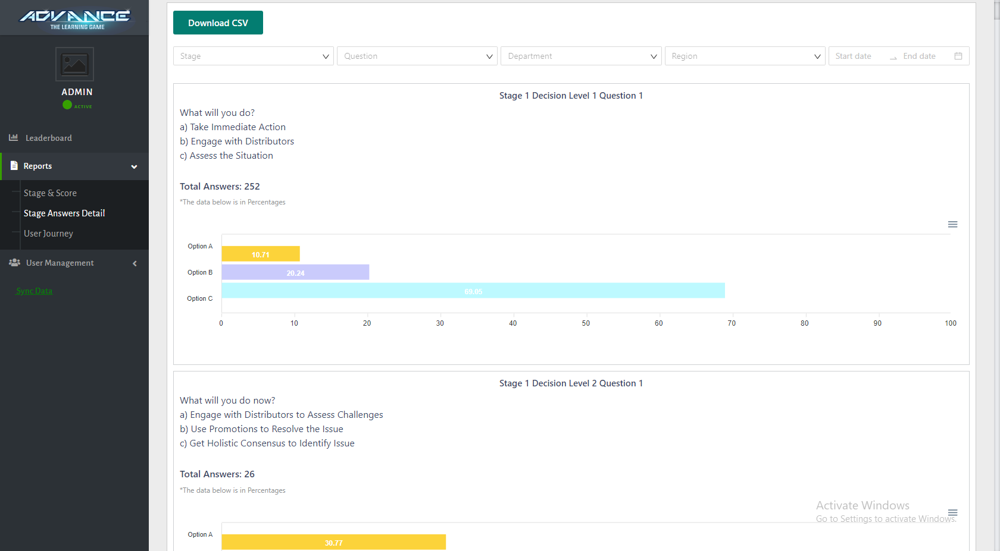

