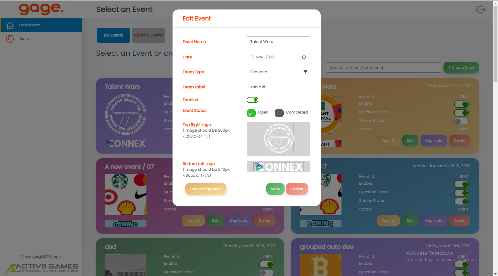

We are a team of skilled Full Stack Developers with many years of combined experience in developing web applications.
Our team has a strong background in software development and has worked with international clients from various
industries such as finance, retail, and e-commerce. As problem solvers at heart, we enjoy working on challenging
projects and delivering innovative solutions.

We have a deep understanding of web development frameworks and have experience in developing custom APIs, integrating
third-party libraries, and optimizing web applications for performance and usability. Throughout our careers, we have
developed many web applications for different platforms such as desktop, mobile and tablets. We are skilled in HTML,
CSS, JavaScript, React, Angular, Node.js and PHP. Our passion for technology and commitment to quality have earned us a
reputation as a reliable and efficient Full Stack Development team.

We have a track record of delivering high-quality projects on time and within budget, and our clients appreciate our
communication skills and our ability to understand their needs and goals. As a team, we collaborate closely with our
clients to ensure that we develop the best possible solutions for their businesses. We take pride in our work and are
committed to providing exceptional service to our clients.

## GAGE
Gage is an employee and group engagement tool designed to deliver insights while creating a shared experience.
Gage transforms team gatherings, surveys and poll taking into an interactive shared experience, while providing valuable
insights and analytics so you can learn more about your people.  
The product is owned by Activ8 Games & developed by Geniteam as sole development partner. This product was used in
Local & international conferences online at various levels.
### Technologies
React, Firebase

